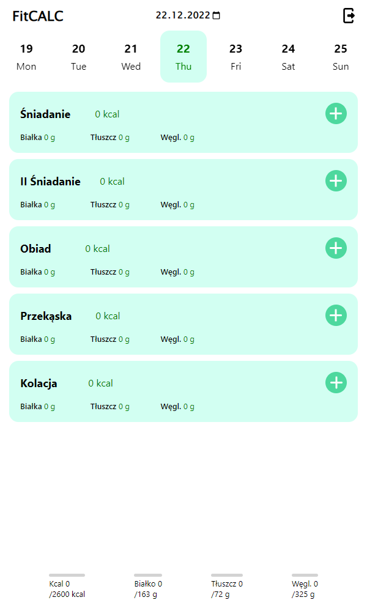
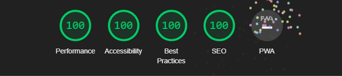

<a name="readme-top"></a>

<!-- PROJECT LOGO -->
<br />
<div align="center">
  <a href="https://fitcalc.online">
    
  </a>

  <h3 align="center">weather-app</h3>

  <p align="center">
    <a href="https://fitcalc.online">View Demo</a>
  </p>
</div>

<!-- ABOUT THE PROJECT -->
## About The Project

 <div align="center">
    
 </div>
 <div align="center">
    
 </div>
 
 <br/>
 
Aplikacja do planowania i zarządzania posiłkami to narzędzie przeznaczone do tworzenia indywidualnych planów żywieniowych i zarządzania posiłkami w ciągu dnia.
<br/>
Użytkownik ma możliwość dodawania własnych produktów do bazy danych aplikacji, co pozwala na dostosowanie planu do indywidualnych preferencji żywieniowych. 
<br/>
W celu zapewnienia wysokiej jakości obsługi, aplikacja została zaprojektowana z użyciem najnowszych technologii i została przetestowana pod kątem stabilności i niezawodności.

### Built With

* [![React][React.js]][React-url]
* [![TypeScript][TypeScript.ts]][TypeScript-url]
* [![React-Leaflet][React-Leaflet.js]][React-Leaflet-url]
* [![Styled-Components][Styled-Components]][Styled-Components-url]

<!-- GETTING STARTED -->
## Getting Started

### Installation

1. Get a free API Key at https://openweathermap.org
2. Clone the repo
   ```sh
   git clone https://github.com/pwmurawski/weather-app.git
   ```
3. Install NPM packages
   ```sh
   npm install
   ```
4. Enter your API in `.env.local`
   ```js
   REACT_APP_API_APPID=your_API_Key
   ```
5. Runs the app in the development mode
   ```sh
   npm start
   ```
   Open http://localhost:3000 to view it in the browser.
   
6. Builds the app for production to the build folder
   ```sh
   npm run build
   ```

<!-- CONTACT -->
## Contact

pwmurawski123@gmail.com

<p align="right">(<a href="#readme-top">back to top</a>)</p>

<!-- MARKDOWN LINKS & IMAGES -->
[React.js]: https://img.shields.io/badge/React-20232A?style=for-the-badge&logo=react&logoColor=61DAFB
[React-url]: https://reactjs.org/
[TypeScript.ts]: https://img.shields.io/badge/TypeScript-20232A?style=for-the-badge&logo=typescript&logoColor=3791d2
[TypeScript-url]: https://www.typescriptlang.org
[React-Leaflet.js]: https://img.shields.io/badge/React%20Leaflet-20232A?style=for-the-badge&logo=Leaflet&logoColor=4dcb9b
[React-Leaflet-url]: https://react-leaflet.js.org
[Styled-Components]: https://img.shields.io/badge/Styled%20Components-20232A?style=for-the-badge&logo=Styled%20Components&logoColor=e9cd16
[Styled-Components-url]: https://styled-components.com
